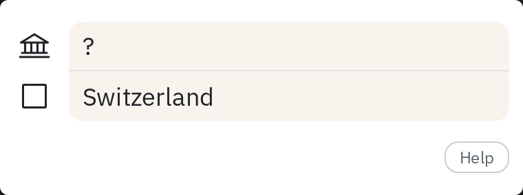
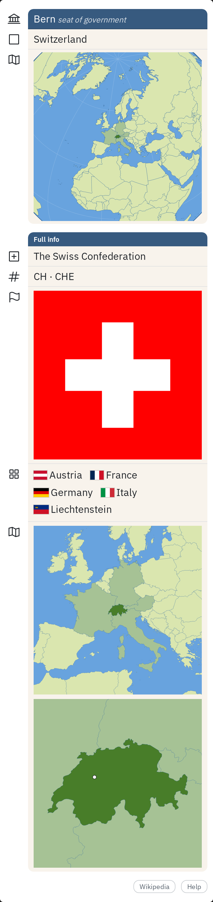
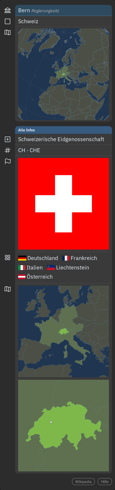
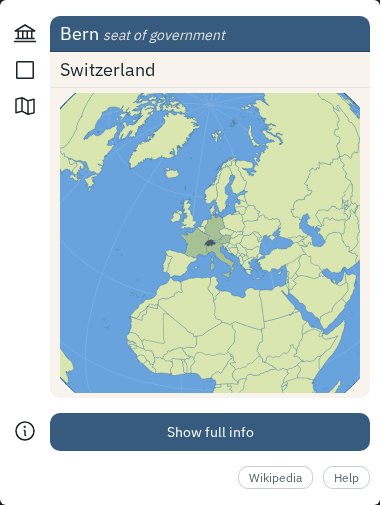
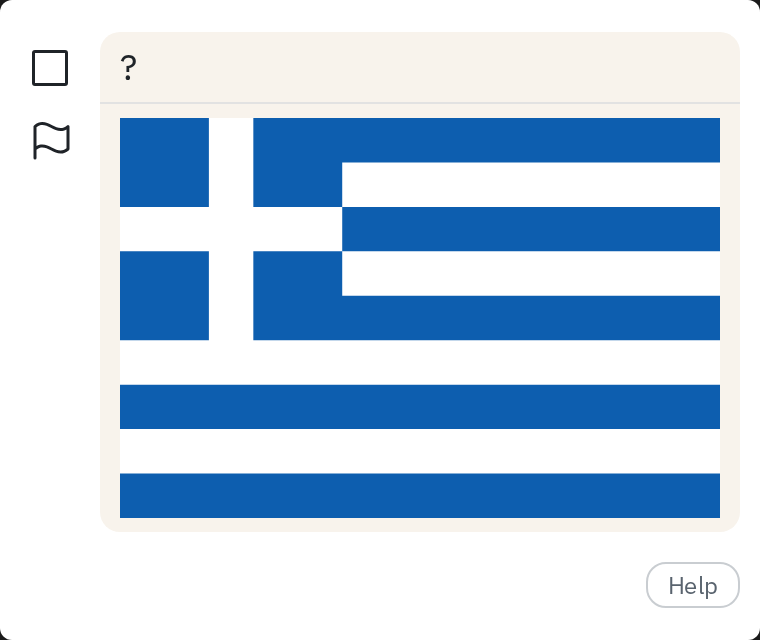
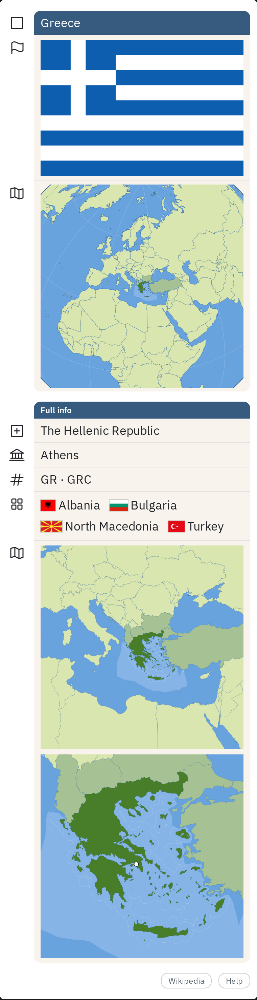
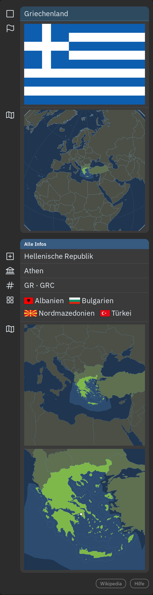
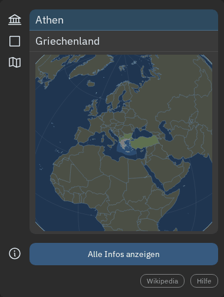

# Countries of the World (COTW)

Anki flashcards for every country and territory of the world: capitals, flags, vector maps
and an interactive globe, in English, German, Polish and Brazilian Portuguese.

- **248 entries:** 195 sovereign states, 49 dependent territories (Greenland, Puerto Rico,
  Åland, …) and 4 disputed areas (Kosovo, Palestine, Taiwan, Western Sahara).
- **Five recommended card types:** country → capital, capital → country, country → flag,
  flag → country, map → country. **Five extras** in a subdeck you can switch off: country →
  map, ISO code in both directions, bordering countries in both directions.
- **Two vector maps per entry:** where the country lies and where its capital is, sharp at
  any size, with the exclusive economic zone and territorial waters.
- **An interactive globe** on the back of every card: drag, zoom, and tap a country to see
  its name.
- **Full info on the back:** formal name, ISO codes, region, neighbors and a Wikipedia link.
- **Day and night mode**, following Anki's setting.
- **Tags by region and status** (`COTW-EN-US::Europe::Western-Europe`,
  `COTW-EN-US::Status::Dependency`, …) for filtered decks, e.g. only Africa.
- **English, German, Polish and Brazilian Portuguese side by side:** install one package or
  several; they share the media and never touch each other's cards.
- **Up to date:** the data comes from Wikidata and is checked for changes every week.
- **Public domain** ([CC0 1.0](LICENSE)), free to use, share and adapt.

## Screenshots

| | Front | Back with full info | Night mode | Globe |
|---|---|---|---|---|
| Country → capital |  |  |  |  |
| Flag → country |  |  |  |  |

Every shot in English and German, day and night, including the Map → Country front:
[`docs/screenshots/switzerland/`](docs/screenshots/switzerland/) and [`docs/screenshots/greece/`](docs/screenshots/greece/).

## Install

- **AnkiWeb:** [English](https://ankiweb.net/shared/info/1365662043) only. All other locales
  are available as `.apkg` files from the release page.
- **Or download** `COTW-EN-US.apkg` / `COTW-DE-CH.apkg` / `COTW-PL-PL.apkg` /
  `COTW-PT-BR.apkg` (up to v1.0.x
  `COTW-EN.apkg` / `COTW-DE.apkg`) from the [latest release](https://github.com/Parapoxvirus/cotw/releases/latest)
  and open it in Anki (*File → Import*). Updating from v1.0.x keeps your notes and review
  history; the tags start with `COTW-EN-US::` / `COTW-DE-CH::` instead of `COTW-EN::` /
  `COTW-DE::`, so filtered decks and saved searches on the old tags need the new ones.

To skip the extras: open the Browser, click the deck *Countries of the World::Extras*
(*Länder der Welt::Extras*, *Kraje świata::Dodatkowe*, *Países do Mundo::Extras*), select all
cards and choose *Suspend*.

## Borders

The maps and the globe draw borders as their source, [Natural Earth](https://www.naturalearthdata.com),
supplies them, and Natural Earth maps **de facto** borders: who actually controls an area.
Crimea, for example, is shown as Russian, not Ukrainian, and the disputed areas in the Himalayas
(Kashmir, Aksai Chin, Arunachal Pradesh) follow the lines of actual control. Overlapping
maritime claims follow the administering party too ([`docs/MAPS.md`](docs/MAPS.md)).
The deck makes no political statement; it follows the supplied data strictly.

## Building the decks

The rest of this page is for development. A single country database generates the
language-specific decks (en-US, de-CH, …), which share one set of language-neutral media (flags,
maps, globe). Design in [`docs/DECISIONS.md`](docs/DECISIONS.md); a weekly Wikidata change
check keeps the data current ([`docs/MONITORING.md`](docs/MONITORING.md)).

```bash
.venv/bin/python -m cotw build-deck      # build/COTW-<LOCALE>.apkg per registered locale, build/deck-preview.html
.venv/bin/python -m cotw build-deck --only RU,KR,ZA --out build/test   # test packages with a few entries
```

- **`COTW-EN-US.apkg`**: deck *Countries of the World*, note type *COTW (EN-US)*, English only.
- **`COTW-DE-CH.apkg`**: deck *Länder der Welt*, note type *COTW (DE-CH)*, German (Swiss
  spelling) only.
- **`COTW-PL-PL.apkg`**: deck *Kraje świata*, note type *COTW (PL-PL)*, Polish only.
- **`COTW-PT-BR.apkg`**: deck *Países do Mundo*, note type *COTW (PT-BR)*, Brazilian
  Portuguese only.

Every registered language gets its package. A language is a BCP 47 locale (`de-CH`): one
module per locale in `tools/cotw/languages/` holds its identities and texts, its sources are
its entry in `data/locales.yaml`, and `python -m cotw validate` requires its names for every
entry. Card types, fields, tags, media, updates and how to add a language:
[`docs/DECK.md`](docs/DECK.md).

## Layout

| Path | Content |
|---|---|
| `data/countries/` | The country database: one YAML file per entry, frozen COTW IDs ([`docs/SCHEMA.md`](docs/SCHEMA.md)) |
| `data/ids.yaml` | The ID ledger |
| `data/wikidata/`, `data/derived/` | Cached Wikidata answers (also the baseline of the weekly change check), Natural Earth land adjacency, flag and maritime-zone manifests (committed, so builds work offline) |
| `data/style/palette.yaml` | Map colors, day and night |
| `media/` | Generated, language-neutral media: `cotw-<id>-flag.svg`, `cotw-<id>-map1-day.svg` / `-night.svg` (orientation), `cotw-<id>-map2-day.svg` / `-night.svg` (capital), the template assets `_cotw-globe.js` and its deferred packets `_cotw-globe-zones.js`, `_cotw-globe-detail.js` (interactive globe) and `ui/` (row icons and help infographics per mode, from `python -m cotw build-ui`) |
| `data/overrides/` | Manual decisions, each with a reason |
| `docs/data-changes.md` | Every deviation from the v3 spreadsheet |
| `tools/cotw/` | Python tooling (`python -m cotw --help`) |
| `tools/globe/` | The globe renderer (plain JS), built into `media/_cotw-globe.js` |
| `tools/cotw/languages/` | One module per deck locale (`en_us.py`, `de_ch.py`, `pl_pl.py`, `pt_br.py`): identity, IDs, names, UI and help texts, region names |
| `tools/cotw/deck/` | The deck build: note types, card templates, CSS, package writer ([`docs/DECK.md`](docs/DECK.md)) |
| `tools/compare_packages.py` | Compares two builds of the packages (output unchanged by a code change?) |
| `data/deck.yaml` | Deck setting: public repository URL for information, contact and error reports |
| `assets/ui/` | Font (IBM Plex Sans, OFL), Phosphor icons (MIT) and the help infographics the deck ships, with their license files |
| `data/tags.txt` | The UN M49 region hierarchy for the `regions` field |
| `data/locales.yaml` | Wanted languages and their sources: Wikipedia, Wikidata label languages, naming source ([`docs/TRANSLATING.md`](docs/TRANSLATING.md)) |

## Development

```bash
python3 -m venv .venv && .venv/bin/pip install -e ".[dev,fetch]"
.venv/bin/python -m cotw validate
.venv/bin/python -m pytest
node --test tests/js/*.test.js                 # globe renderer (Node ≥ 20)
```

Media:

```bash
.venv/bin/python -m cotw fetch-flags          # Wikidata P41 → Commons SVG, license check (network)
.venv/bin/python -m cotw fetch-naturalearth   # Natural Earth 10m map units into .cache/ (network)
.venv/bin/python -m cotw fetch-marineregions  # EEZ + 12 nm from the Marine Regions WFS into .cache/ (network, ~170 MB)
.venv/bin/python -m cotw build-maps [ID …]    # render the maps from the cache, write build/preview.html
.venv/bin/python -m cotw build-globe          # split globe assets from the same cache, write build/globe-preview.html
.venv/bin/python -m cotw build-ui [--check]   # media/ui/: icons + infographics per mode (--check: fidelity vs. the v3 PNGs)
```

Change monitoring ([`docs/MONITORING.md`](docs/MONITORING.md)):

```bash
.venv/bin/python -m cotw check-wikidata --dry-run    # caches vs. live Wikidata/Commons (network), writes nothing
.venv/bin/python -m cotw accept-wikidata <fingerprint>   # accept one reported change into the caches
.venv/bin/python -m cotw import-monitor-issues [--apply] # once, when switching to Paperclip tasks
```

The scheduled workflow `.gitea/workflows/wikidata-check.yml` runs the check every Monday and
opens one `wikidata` issue per change, or one Paperclip task when the `PAPERCLIP_*` variables
are set.

Map rendering rules (projection, windows, highlight circles, maritime-zone assignment)
are documented in [`docs/MAPS.md`](docs/MAPS.md); the globe and its template contract in
[`docs/GLOBE.md`](docs/GLOBE.md).

## Sources and attribution

[Wikidata](https://www.wikidata.org) (CC0), [Natural Earth](https://www.naturalearthdata.com)
(public domain), icons from [Phosphor Icons](https://phosphoricons.com) (MIT, full notice in
`assets/ui/LICENSE-PhosphorIcons.txt` and in every package), the font IBM
Plex Sans (SIL OFL 1.1), flags from [Wikimedia Commons](https://commons.wikimedia.org) (public
domain / CC0 only, per file in `data/derived/flags.yaml`), and maritime zones from
[Marine Regions](https://www.marineregions.org) by the Flanders Marine Institute (VLIZ),
**CC BY 4.0**:

> Flanders Marine Institute (2023). Maritime Boundaries Geodatabase: Maritime Boundaries
> and Exclusive Economic Zones (200NM), version 12, and Territorial Seas (12NM), version 4.
> Available online at https://www.marineregions.org/. https://doi.org/10.14284/632,
> https://doi.org/10.14284/633

Details in [`docs/ATTRIBUTION.md`](docs/ATTRIBUTION.md).

## Contributing

Corrections and new languages are welcome. How pull requests reach the main COTW repository
and are credited: [`CONTRIBUTING.md`](CONTRIBUTING.md). Adding a language, the naming sources
per language and the spelling rules: [`docs/TRANSLATING.md`](docs/TRANSLATING.md).
For more information or contact, use this repository; report errors through its issue tracker.

## License

Code, data and deck are dedicated to the public domain under
[CC0 1.0](LICENSE) by Parapoxvirus, except the maritime-zone geometry in the maps and
the globe (Marine Regions, CC BY 4.0, see above), the font (OFL) and the icons (MIT). Knowledge is free.
